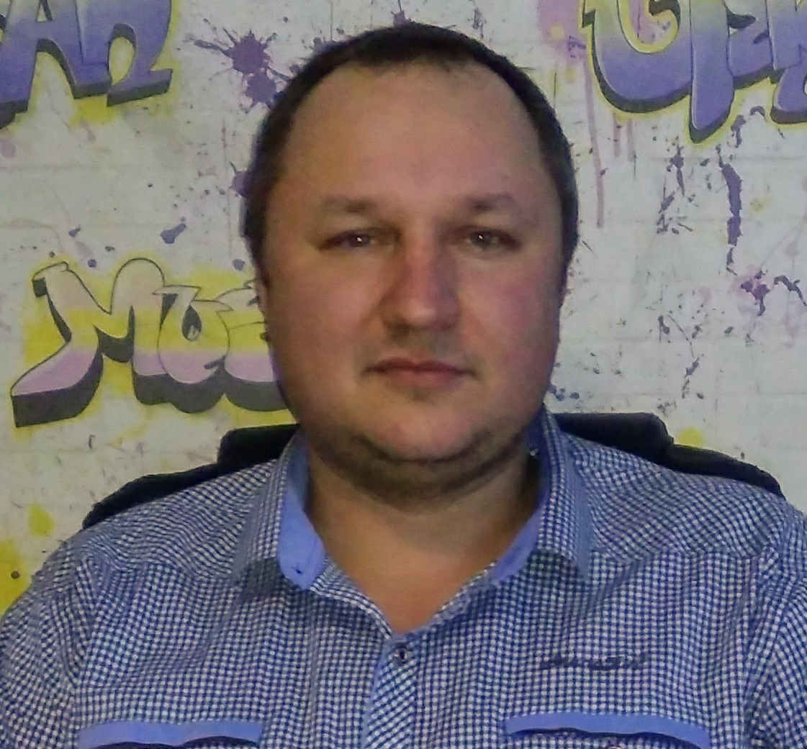

# **Andrew Barkovets**

## **Contact**
  * Telephone: +375445633162
  * E-mail: andrewbarkovets@gmail.com
  * [Telegram:](https://t.me/andrewbarkovets)
  * [VK:](https://vk.com/andrewbarkovets)
  * [Freelance profile](https://freelance.ru/andrewbarkovets)

***

## **ABOUT ME**

***

## **Skills and abilities:**
  * photoshop, figma
  * HTML5, CSS3 (BEM, flexbox, Perfect Pixel)
  * JavaScript
  * Github

***

## **Сode example**

***

## **EDUCATION**
  * Online coaching WAYUP, WEB layout designer
    _November 2019 – February 2020_

        During the training I mastered HTML, CSS, Responsive & Adaptive, Flex Box, Bootstrap, the basics of Java Script and JQuery, hosting, CMS WordPress

  * Online course Glo Academy, Java Script
    _October 2020 – November 2020_

        During the training, I mastered the basics of working with Git. Data types, operators, methods and properties, functions, scope and closure, objects and arrays, DOM+DevTools, storage, OOP, ES6, working with JSON, AJAX, Try catch, Fetch. Webpack Basics (Babel, Polyfills)

***

## ** **

***
